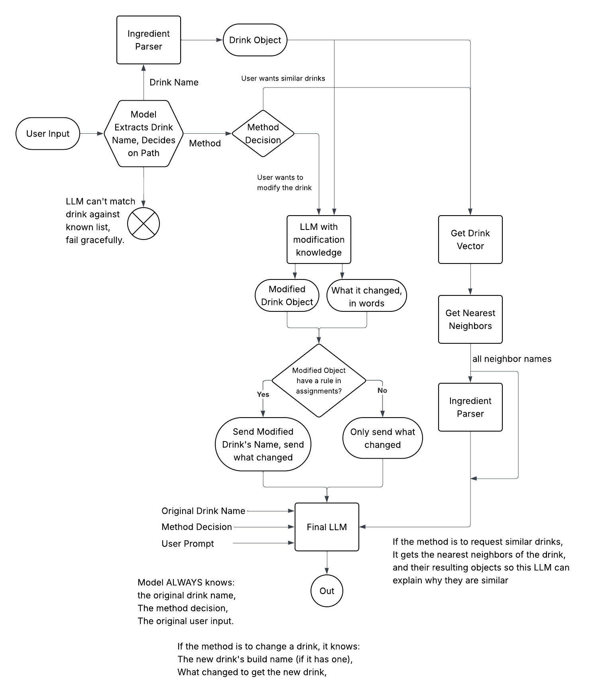

# DrinkAdvisor

A conversational drink recommendation system for Dutch Bros Coffee. Customers describe what they want in natural language ("something like a Golden Eagle", "the Annihilator but less chocolate") and receive a barista-style recommendation powered by a rule-based drink engine and semantic vector similarity.

---

## Data Path: Query → Response


## TLDR - Datapath
1. User Query is parsed by an LLM to extract the drink name, additional tokens, and intent of the query.
      Example: Query: How can I make the aftershock with cold foam more sour?
      Ex:  
         Drink name: Aftershock 
         Extra tokens: Soft top (inferred by LLM from cold foam) 
         Intent: Modify the drink
2. Rule engine converts tokens to a structured DrinkObject containing ingredients
3. Branch based on intent. Options: Similarity (recommend drinks like the ...) Modify: I want the ... but more ...
   3a. If the intent is similarity search, convert flavors into a single flavor profile vector and query vector database for cosine similarity. Then run the neighbors through the rule engine so that the final LLM knows how they differ.
   3b. If the intent is modifying a drink, give the drink object and user query to an LLM along with domain drink knowledge explaining what is possible to modify, and let the LLM modify the drink object directly. Returns the modified object and an english description of what was done.
4. If the drink object is modified, check against the assignments.json from the rule engine to see if the new drink has a build name.
5. A final LLM responds to the user. This LLM is always given the user query, the original drink name, and the method decision.
   5a. If the method decision is to modify the drink, the final LLM also gets the modified drink object/build name (if applicable)
   5b. If the method decision is for similar drinks, the final LLM gets the nearest neighbors of the drink and their DrinkObjects.


## How the Rule Engine Works

The rule engine (`backend/lib/engine.py` → `process_order()`) is what converts an ingredient token dict — e.g. `{"caramelizer": 1, "oat_milk": 1}` — into a fully structured `DrinkObject`. It runs up to five passes until the ingredient set stabilizes:

1. **Classify** — Tokens imply other tokens. "caramelizer" implies caramel + vanilla; "freeze" implies ice. Fires classification rules until no new tokens are added.
2. **Profile** — Selects a drink profile (size/intensity characteristics) based on priority rules.
3. **Assign** — Populates ingredient roles: `flavors`, `toppings`, `milk`, `base`, `coffee`. Quantity operators (e.g. "2x chocolate") are respected.
4. **Quantity** — Sets shot and scoop counts via set/min/max rules.
5. **Modifier** — Post-assignment tweaks: add, remove, multiply, or override ingredients.

Rules are stored in a SQLite database seeded at first startup from JSON files in `backend/lib/rules/`. A fresh connection is used per request.

**The rule engine runs in three places in the pipeline:**
- Step 1: builds the `DrinkObject` for the drink the customer mentioned
- Step 2a: builds a `DrinkObject` for each of the 5 nearest-neighbor drinks
- Step 2a: builds a `DrinkObject` for each of the 5 nearest-neighbor drinks returned by vector similarity

---

## What the Token/Ingredient Parser Does

Before the rule engine can run, raw text must become a token dict. Two things handle this:

**LLM extraction (Step 1):** The LLM receives the full list of `KNOWN_TOKENS` alongside the user's message and returns `{"token_name": count, ...}`. This handles natural phrasing ("a little less sweet", "add some caramel on top") that strict pattern matching would miss.

**`get_token_maps.py` (greedy matcher):** Used as a fallback and for programmatic name-to-token resolution (e.g. resolving a neighbor drink's name to tokens). It:
1. Loads all known tokens from `backend/lib/data/tokens.csv`
2. Sorts by length — longest first — to prevent substring collisions (so "cold brew" matches before "brew")
3. Cleans input: lowercases, converts fractions (`1/4` → "quarter"), replaces `%` with "percent"
4. Greedily matches and removes matched spans, returning `{token: count}`

---

## Vector Similarity

`vector_db.json` holds precomputed vectors for 153 drink builds. Each drink has:
- A **28-dimensional semantic vector** — flavors bucketed into semantic categories (sweet, fruity, citrus, berry, tropical, chocolatey, etc.)
- A **39-dimensional raw vector** — one-hot over individual flavor ingredients

The similarity step uses **cosine similarity on semantic vectors** by default. The `recommend.py` module also supports raw (Jaccard on flavor sets) and hybrid (60% semantic + 40% raw) modes.

Rebuild the index with `build_index.py` if the drink menu changes.

---

## Pipeline Steps (Detail)

### Step 1 — Intent Extraction (`backend/pipeline/intent.py`)
**Input:** raw user text  
**Output:** `IntentResult`, `DrinkObject`, engine result

Calls OpenAI with `intent_extraction.txt`. The prompt receives the full list of known drink names (from `vector_db.json` builds) and the full list of `KNOWN_TOKENS`. The LLM identifies the drink name, infers any additional ingredient tokens (translating natural language like "cold foam" → `soft_top`), and classifies the user's intent as either `"similar"` or `"modify"`. It returns:

```json
{
  "drink_name": "aftershock",
  "tokens": {"aftershock": 1, "soft_top": 1},
  "method": "modify",
  "confidence": 0.95,
  "error": null
}
```

The token dict is then passed to `process_order()`, which runs the rule engine and returns a structured `DrinkObject`. Stops the pipeline with a graceful error if no drink is matched (`DRINK_NOT_FOUND`) or if the LLM returns malformed JSON (retried once before failing).

### Step 2a — Similarity (`backend/pipeline/similarity.py`)
**Triggered when:** `method == "similar"`  
**Input:** drink name  
**Output:** `list[NeighborResult]`

The drink's flavor profile is converted into a 28-dimensional semantic vector and queried against `vector_db.json` via cosine similarity. Returns the 5 nearest neighbor drinks. For each neighbor, the rule engine builds a `DrinkObject` so the final LLM knows exactly how they differ from the original. No LLM call.

### Step 2b — Modification (`backend/pipeline/modifier.py`)
**Triggered when:** `method == "modify"`  
**Input:** `DrinkObject`, user's raw request  
**Output:** `ModifierResult` (modified `DrinkObject` + change description)

Calls OpenAI with `modifier_system.txt`, injected with `drink_knowledge.txt` which describes what ingredients are available to work with. The LLM receives the original `DrinkObject` as JSON alongside the user's request, edits the drink object directly (adjusting flavors, toppings, milk, etc.), and returns both the modified object and a plain-English description of what changed. Only ingredients listed in `drink_knowledge.txt` may be used.

### Step 3 — Assignment Check (`backend/pipeline/assignment.py`)
**Triggered after:** Step 2b only  
**Input:** modified `DrinkObject`  
**Output:** `AssignmentResult`

Checks whether the modified drink's flavor set exactly matches a named build in `assignments.json` (from the rule engine). If yes, the matched build name is forwarded to Step 4 so the final response can tell the customer their modification is actually a real menu item. No LLM call.

### Step 4 — Final Response (`backend/pipeline/final.py`)
**Always runs**  
**Input:** `FinalLLMInput` (everything from the relevant path)  
**Output:** natural language string

Calls OpenAI with `final_system.txt`. Always receives the user's original query, the drink name, and the method decision. On the similarity path, it also gets the nearest neighbor drinks and their `DrinkObject`s to explain how they compare. On the modification path, it gets the modified `DrinkObject`, the description of what changed, and the build name if Step 3 found a match. Returns 3–6 sentences in a warm, barista-style tone with no technical jargon.

---

## Setup

### Backend

1. Copy `.env.example` to `.env` and fill in your OpenAI API key:
   ```
   cp .env.example .env
   ```

2. Install Python dependencies:
   ```
   pip install fastapi uvicorn openai pydantic python-dotenv pandas numpy
   ```

3. Start the backend:
   ```
   uvicorn backend.main:app --reload
   ```
   The API will be available at `http://localhost:8000`. The SQLite rules database is automatically seeded on first startup — no manual migration needed.

### Frontend

1. From the `frontend/` directory:
   ```
   npm install
   npm run build
   ```

2. Open `frontend/index.html` in a browser, or serve with:
   ```
   npx serve frontend/
   ```

---

## Prompts (`backend/prompts/`)

| File | Purpose |
|------|---------|
| `intent_extraction.txt` | Step 1 — extracts drink name, tokens, and method from user input. Inject `{drink_list}` and `{token_list}` at runtime. Returns JSON only. |
| `modifier_system.txt` | Step 2b — modifies a drink object per user request. Inject `{drink_knowledge}` at runtime. Returns JSON only. |
| `drink_knowledge.txt` | Injected into the modifier prompt — lists available flavors, toppings, milk types, bases. **TODO: replace placeholder with live data from `DrinkBuilder/rules/assignments.json`.** |
| `final_system.txt` | Step 4 — generates the final user-facing recommendation. Returns plain text. |

---

## Key Files

| Path | Role |
|------|------|
| `backend/main.py` | FastAPI app setup, startup hook |
| `backend/routers/recommend.py` | `POST /recommend` — orchestrates the full pipeline |
| `backend/pipeline/intent.py` | Step 1 |
| `backend/pipeline/similarity.py` | Step 2a |
| `backend/pipeline/modifier.py` | Step 2b |
| `backend/pipeline/assignment.py` | Step 3 |
| `backend/pipeline/final.py` | Step 4 |
| `backend/pipeline/audit_log.py` | Writes `logs/pipeline_audit.jsonl` |
| `backend/lib/engine.py` | 5-phase rule engine (`process_order`) |
| `backend/lib/db.py` | SQLite connection manager |
| `backend/lib/get_token_maps.py` | Greedy token matcher |
| `backend/lib/rules/*.json` | classify, profile, quantity, assign, modifier rules |
| `backend/lib/data/tokens.csv` | Known token vocabulary |
| `backend/models.py` | All Pydantic models |
| `vector_db.json` | Precomputed drink flavor vectors (153 builds, 28 semantic dims) |
| `recommend.py` | Cosine/Jaccard similarity engine (used by Step 2a) |
| `build_index.py` | Rebuilds `vector_db.json` |

---

## TODOs

- **`backend/prompts/drink_knowledge.txt`**: Replace the placeholder ingredient list with live data derived from `DrinkBuilder/rules/assignments.json` and `DrinkBuilder/data/ingredients.csv` so the modifier LLM only uses real ingredients.

- **Known drinks list (intent prompt)**: Currently sourced from `vector_db.json` builds, which only indexes flavor-vectorized drinks. Should be expanded to cover all named builds in `DrinkBuilder/rules/assignments.json` for broader intent matching.
